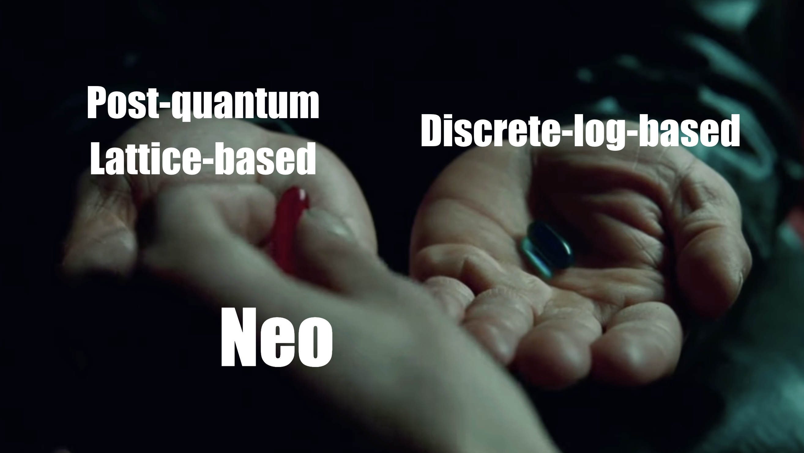

# NeoFold ドキュメント（ドラフト）

NeoFold は、Neo プロトコルの実装を目的としたライブラリであり、コンパクトなコードベースと、端末上での証明生成に最適化された設計を特徴とします。Rust を用いた実装により、Folding Scheme ベースの zk アプリケーションや zkVM の基盤として利用できることを目指しています。

---

## Neo と NeoFold の位置づけ

Neo は、Wilson Nguyen と Srinath Setty によって提案された LatticeFold の改良版であり、同じく LatticeFold の提案者である Dan Boneh や Binyi Chen らによる LatticeFold+ とは異なる系譜で発展しているプロトコルです。格子ベースのコミットメントを土台にしつつ、Matrix Commitment Scheme を導入することで、witness の構造と大きさに応じた効率的なコミットを可能にしています。

Neo の Matrix Commitment Scheme の大きな特徴は、witness の値が小さいほど、そのコミットコストが下がる点にあります。特にゼロに対するコミットメントはコストがゼロになり、Pedersen Hash をはじめとする離散対数ベースのコミットメントが持っていた「ゼロに優しい」性質を、格子ベースの世界で再現していると言えます。この性質により、Nebula などの Folding Scheme の研究によって蓄積されたテクニックを、そのまま Neo 上でも活用することができます。

さらに Neo は、オリジナルの LatticeFold 論文で議論されていた Ring上でのAjtaiCommitment を継承しており、同様に量子計算機に対する耐性を備えています。別の見方をすると、Neo の Matrix Commitment Scheme は、LatticeFold で用いられている環上の AjtaiCommitment を、より効率的に実装した一形態であるとも解釈できます。

LatticeFold については Nethermind による部分的な実装が存在しますが、Neo についてはそうした実装がこれまで存在していないため(または見つけられなかったため)、このNeoFoldを実装しています。

---

## 実装方針と MLE の扱い

NeoFold の実装では、多項式の取り扱いにおいて、既存ライブラリである ark-works とは異なる設計を採用しています。ark-works の MLE（Multilinear Extension）は、多項式を evaluation form で管理するアプローチを取っていますが、NeoFold では多項式そのものを Rust のクロージャとして表現します。

この設計により、プログラムとして記述された式と、多項式として解釈される式の見た目がほとんど一致します。サムチェックなどの典型的な処理も、通常の Rust コードと同じ感覚で記述できるため、Folding Scheme を実装する際の認知的負荷が大きく下がります。Neo においては、Prover 側だけでなく Verifier 回路内でも MLE を利用することが重要であり、このような「Rust 的で直感的な」表現は回路・プロトコルの両方を見通しよく実装する助けになります。

---

## Waseki 回路システム

NeoFold では、回路記述のために独自の回路システムである Waseki を採用しています。これは、NeoFold や zkVM の実装において必要となる回路が、Rust で記述される Prover プログラムと密接に結びついているという事情によるものです。Noir のような専用言語は回路の記述性に優れていますが、Rust コードとの密結合が難しく、また Rust の回路システムとしてデファクトである ark-r1cs-std は、回路記述を非常に読みにくくしてしまう可能性がありました。

さらに、Nebula で提案されている Switchboard のような構成を表現するには、既存の抽象化では不十分な場面がありました。そこで、回路の書きやすさを最優先するという思想のもとで設計されたのが Waseki です。将来的には Waseki の内部で ark-r1cs-std を利用しつつ、互換性のある回路を生成できる状態を目指しています。

現在の Waseki は、回路生成時のパフォーマンスを犠牲にする代わりに、回路の記述性を高める設計になっています。回路の変数は Copy トレイトを実装しており、制約や witness はプログラムのグローバルステートとして保存されます。この結果、回路記述者は ark-ff の Field 型の変数を扱うのとほぼ同じ感覚で、回路用の変数を使うことができます。

この過激なデザインは、回路記述のしやすさという大きなメリットをもたらす一方で、回路生成においてはパフォーマンス低下を引き起こす可能性があります。ただし Folding Scheme 全般に共通する特徴として、回路の生成は本番運用の中で何度も繰り返される処理ではありません。実運用では、あらかじめ生成された回路を再利用することが多いため、回路生成時のオーバーヘッドはプロダクション環境にはほとんど影響しません。Waseki は、VHDL のように回路を定義するための記述システムだと考えるとイメージしやすいでしょう。

Waseki によるコードは、回路部分とそれ以外のロジックが密結合しているため、どこからどこまでが制約で、どこからが Prover 用ロジックなのかが一見して分かりづらい場面があります。NeoFold のコードを読む際には、型が Var<F> なのか、それとも通常の F なのかを注意深く確認してください。Var<F> 型を用いた計算はすべて回路上の制約を表し、それ以外の計算は witness を導出するための Prover 側の処理になります。

---

## RangeCheck の例

Waseki による回路記述の雰囲気を示すために、64 ビットの RangeCheck を行う簡単な例を紹介します。次のコードは、回路変数 var の内部値 val を取り出し、それをビット分解した値を witness として割り当てます。そのうえで、各ビットに重みとして 2^i を掛けた線形結合の結果が、元の変数 var と一致することを制約として追加します。

```rust
let var = Var::from(10);
let val = var.value().into_bigint();
(0..64)
    .map(|i| {
        let b = Var::from(val.get_bit(i));
        (2 << i) * b
    })
    .sum()
    .equal(var);
```

このコードでは、Var::from により回路変数が生成され、value() によってその内部値を取得しています。ビットごとに Var<bool> に相当する変数 b を割り当て、それらを 2^i 倍して足し合わせた結果と var が equal であることを主張することで、var が 64 ビット整数として妥当な範囲にあることを保証します。通常の Rust コードと非常に似た見た目で RangeCheck を記述できる点が、Waseki の設計思想をよく表しています。

---

## NOTE

NeoFold は、Neo の Matrix Commitment Scheme を実装し、格子ベースかつ量子耐性のある Folding Scheme を現実的に利用可能な形で提供することを目標としています。Rust クロージャによる MLE の表現と、Waseki 回路システムによる直感的な回路記述により、プロトコルレベルと実装レベルのギャップを小さくし、研究成果をそのまま実装へと落とし込みやすい環境を整えることを狙っています。

NeoFold のコードベースを追いながら、Var<F> と F の違い、witness 計算と制約追加の境界、そして Neo 特有の Matrix Commitment Scheme の使われ方に注目していくことで、Folding Scheme ベースの zk システム設計の全体像をより深く理解できるはずです。

